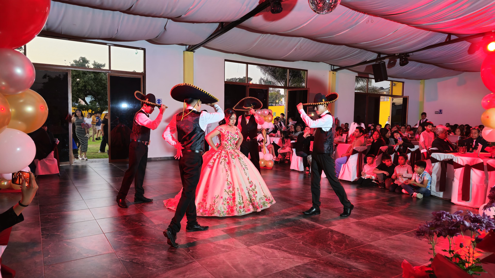

<!DOCTYPE html>
<html lang="es">
<head>
    <meta charset="UTF-8">
    <meta name="viewport" content="width=device-width, initial-scale=1.0">
    <title>STYLE FACTOR DANCE CHAMBELANES</title>
    <link href="https://fonts.googleapis.com/css2?family=Playfair+Display&display=swap" rel="stylesheet">
    
    <link rel="stylesheet" href="https://cdnjs.cloudflare.com/ajax/libs/font-awesome/6.0.0-beta3/css/all.min.css">
</head>
<body>
    <header>
        

            

                
            

            

            <nav>
                <ul>
                    <li><a href="#inicio">Inicio</a></li>
                    <li><a href="#nosotros">Nosotros</a></li>
                    <li><a href="#paquetes">Paquetes</a></li>
                    <li><a href="#galeria">Galería</a></li>
                    <li><a href="#contacto">Contacto</a></li>
                </ul>
            </nav>
        

    </header>

    <section id="nosotros">
        

            

                <h2 style="color:#121313";>Sobre Nosotros</h2>
            

            

                

                    

<strong>STYLE FACTOR DANCE CHAMBELANES</strong> es la agencia líder en servicios para eventos sociales, especializada en <strong>chambelanes profesionales</strong>, <strong>coreografías personalizadas para bodas y quinceañeras</strong>, y espectáculos visuales que marcan diferencia.
 
<li>Nos dedicamos a crear momentos inolvidables con elegancia, estilo y profesionalismo, ofreciendo <strong>pistas iluminadas</strong>, <strong>letras gigantes con luz LED</strong>, y presentaciones que fusionan danza y ambientación para elevar cualquier celebración.
 
<li>Nuestro equipo está formado por bailarines altamente capacitados, con años de experiencia en bodas, quinceañeras, festivales y todo tipo de eventos especiales.
 
<li>Lo que nos diferencia es nuestra pasión por el arte escénico, nuestro compromiso con la calidad y nuestra habilidad para personalizar cada espectáculo según la visión de nuestros clientes.

                

                

                    
                

            

        

    </section>

    <section class="packages" id="paquetes">
        

            

                <h2>Nuestros Paquetes</h2>
            

            

                

                    <h3>Plata</h3>
                    
$6,200 MXN

                    <ul>
                        <li> Vals de Entrada</li>
                        <li> Vals Principal</li>
                        <li>Vals de Salida</li>
                        <li>Vals Muñeca</li>
                        <li>Brindis</li>
			<li>Vals Familiar</li>
			<li>Baile sorpresa (2-3 minutos)
			<li>Show Style Factor
			<li>Coreógrafo personal (Vals y show sorpresa)</li>
			<li>Maestra de ceremonia</li>
			<li>4 chambelanes Show Sorpresa</li>
			<li>4 chambelanes Vals</li>
                         
			
Incluye:

			 
			<li>3 Disparos de pirotecnia fría</li>
			<li>3 Bazucas de papel picado </li>
			
                    </ul>
                    <a href="#contacto" class="btn">Reservar</a>
                

                

                    <h3>Oro</h3>
                    
$7,400 MXN

                    <ul>
                        <li> Vals de Entrada</li>
                        <li> Vals Principal</li>
                        <li>Vals de Salida</li>
                        <li>Vals Muñeca, Corona y Zapatillas</li>
                        <li>Brindis</li>
			<li>Vals Familiar</li>
			<li>Baile sorpresa (3-4 minutos)</li>
			<li>Show Style Factor</li>
			<li>Coreógrafo personal (Vals y show sorpresa)</li>
			<li>Vestuario a elegir(Show Sorpresa)</li>
			<li>Maestra de ceremonia</li>
			<li>6 chambelanes Show Sorpresa</li>
			<li>4 chambelanes Vals</li>
			 
			
Incluye:

			 
			<li>¡Acompañamiento desde Misa!</li>
			<li>2 Maquinas de efectos especiales (Humo o Fuego) </li>
			<li>4 Disparos de pirotecnia fría</li>
			<li>4 Bazucas de papel picado </li>
                    </ul>
                    <a href="#contacto" class="btn">Reservar</a>
                

                

                    <h3>Diamante</h3>
                    
$8,200 MXN

                    <ul>
			<li>Presentación</li>
                       <li> Vals de Entrada</li>
                        <li> Vals Principal</li>
                        <li>Vals de Salida</li>
			<li>Vals Sorpresa</li>
                        <li>Vals Muñeca, Corona y Zapatillas</li>
                        <li>Brindis</li>
			<li>Vals Familiar</li>
			<li>Baile sorpresa (4-5 minutos)</li>
			<li>Show Style Factor</li>
			<li>Coreógrafo personal (Vals y show sorpresa)</li>
			<li>Vestuario a elegir(Show Sorpresa)</li>
			<li>Maestra de ceremonia</li>
			<li>8 chambelanes Show Sorpresa</li>
			<li>4 chambelanes Vals</li>
			 
			
Incluye:

			 
			<li>¡Acompañamiento desde Misa!</li>
			<li>2 Maquinas de Humo vertical </li>
			<li>2 Maquinas de Fuego Vertical</li>
			<li>5 Disparos de pirotecnia fría</li>
			<li>5 Bazucas 80cm de papel picado </li>

                    </ul>
                    <a href="#contacto" class="btn">Reservar</a>
                

            

        

    </section>

    <section id="galeria">
        

            

                <h2 style="color:#000302";>Galería</h2>
            

            

                

                    
                

                

                    
                

                

                    
                

                

                    
                

                

                    
                

                

                    
                

	        

                    
                

		

                    
                

		

                    
                

		

                    
                

		

                    
		

		

                    
                

                

            

        

    </section>
  
  <blockquote class="tiktok-embed" cite="https://www.tiktok.com/@stylefactordance/video/7492273597302541574" data-video-id="7492273597302541574" style="max-width: 605px;min-width: 325px;" > <section> <a target="_blank" title="@stylefactordance" href="https://www.tiktok.com/@stylefactordance?refer=embed">@stylefactordance</a> ¡El mejor baile sorpresa para tus XV! 🔥😱  <a title="xvaños" target="_blank" href="https://www.tiktok.com/tag/xva%C3%B1os?refer=embed">#xvaños</a> <a title="quinceaños" target="_blank" href="https://www.tiktok.com/tag/quincea%C3%B1os?refer=embed">#quinceaños</a> <a title="quinceañeras" target="_blank" href="https://www.tiktok.com/tag/quincea%C3%B1eras?refer=embed">#quinceañeras</a> <a title="quinceañera" target="_blank" href="https://www.tiktok.com/tag/quincea%C3%B1era?refer=embed">#quinceañera</a> <a title="quinceañeraviral" target="_blank" href="https://www.tiktok.com/tag/quincea%C3%B1eraviral?refer=embed">#quinceañeraviral</a> <a title="misquinceaños" target="_blank" href="https://www.tiktok.com/tag/misquincea%C3%B1os?refer=embed">#misquinceaños</a> <a title="misxvaños💙" target="_blank" href="https://www.tiktok.com/tag/misxva%C3%B1os%F0%9F%92%99?refer=embed">#misxvaños💙</a> <a title="rauwalejandro" target="_blank" href="https://www.tiktok.com/tag/rauwalejandro?refer=embed">#rauwalejandro</a> <a title="bailesorpresa" target="_blank" href="https://www.tiktok.com/tag/bailesorpresa?refer=embed">#bailesorpresa</a> <a title="bailesorpresaxv" target="_blank" href="https://www.tiktok.com/tag/bailesorpresaxv?refer=embed">#bailesorpresaxv</a> <a title="punto40rauwalejandro" target="_blank" href="https://www.tiktok.com/tag/punto40rauwalejandro?refer=embed">#punto40rauwalejandro</a> <a title="punto40" target="_blank" href="https://www.tiktok.com/tag/punto40?refer=embed">#punto40</a> <a title="carolinarauwalejandro" target="_blank" href="https://www.tiktok.com/tag/carolinarauwalejandro?refer=embed">#carolinarauwalejandro</a> <a title="bailereggaeton" target="_blank" href="https://www.tiktok.com/tag/bailereggaeton?refer=embed">#bailereggaeton</a> <a title="regatones" target="_blank" href="https://www.tiktok.com/tag/regatones?refer=embed">#regatones</a> <a title="stylefactorchambelanes" target="_blank" href="https://www.tiktok.com/tag/stylefactorchambelanes?refer=embed">#stylefactorchambelanes</a> <a target="_blank" title="♬ sonido original - Style Factor Dance Oficial" href="https://www.tiktok.com/music/sonido-original-7492273614097566470?refer=embed">♬ sonido original - Style Factor Dance Oficial</a> </section> </blockquote>   <blockquote class="tiktok-embed" cite="https://www.tiktok.com/@stylefactordance/video/7477311455356800262" data-video-id="7477311455356800262" style="max-width: 605px;min-width: 325px;" > <section> <a target="_blank" title="@stylefactordance" href="https://www.tiktok.com/@stylefactordance?refer=embed">@stylefactordance</a> 

 <a target="_blank" title="‚ô¨ sonido original - Style Factor Dance Oficial" href="https://www.tiktok.com/music/sonido-original-7477311483530644279?refer=embed">‚ô¨ sonido original - Style Factor Dance Oficial</a> </section> </blockquote> 

        
    

</section>

    <section id="contacto">
        

            

                <h2 style="color:#000302";>Contacto</h2>
            

            

                

                    <i class="fas fa-map-marker-alt"></i>
                    <h3>Ubicación</h3>
                    
C. Uranga 38, Barrio del Calvario, 72700 San Juan Cuautlancingo, Pue.

                

                

                    <i class="fas fa-phone-alt"></i>
                    <h3>Teléfono</h3>
                    
+52 222 154 8706

		    <a href="https://w.app/stylefactor"class="btn" target="_blank">Mensaje Directo</a>

                

                

                    <i class="fas fa-clock"></i>
                    <h3>Horario</h3>
                    
Lunes a Viernes 5:00 PM - 8:30 PM

                

            

            

                <iframe src="https://www.google.com/maps/embed?pb=!1m18!1m12!1m3!1d4483.73858066705!2d-98.27395762783392!3d19.091869740311306!2m3!1f0!2f0!3f0!3m2!1i1024!2i768!4f13.1!3m3!1m2!1s0x85cfc7174b366ff1%3A0xe8d61f1abf2a4269!2sSTYLE%20FACTOR%20grupo%20valsistico!5e0!3m2!1ses-419!2smx!4v1753140993728!5m2!1ses-419!2smx" width="600" height="450" style="border:0;" allowfullscreen="" loading="lazy" referrerpolicy="no-referrer-when-downgrade"></iframe>
            

        

    </section>

    <section class="social-media">
        

            <h2 style="color:#ffffff";>Síguenos en Redes Sociales</h2>
            

                <a href="https://www.facebook.com/StyleFactorDance/"><i class="fab fa-facebook-f"></i></a>
                <a href="https://www.instagram.com/style.factor.dance/"><i class="fab fa-instagram"></i></a>
                <a href="https://www.tiktok.com/@stylefactordance"><i class="fab fa-tiktok"></i></a>
                <a href="https://www.youtube.com/@stylefactordanceoficial4822"><i class="fab fa-youtube"></i></a>
            

        

                    
            
    </section>

<section class="testimonials">
    

        

            <h2 style="color:#000302;">Deja tu opinión</h2>
        

        <form class="review-form" id="reviewForm">
            

                <label for="name">Nombre:</label>
                <input type="text" id="name" name="name" required>
            

            

                <label for="rating">Calificación:</label>
                

                    <input type="radio" id="star5" name="rating" value="5" required>
                    <label for="star5">★</label>
                    <input type="radio" id="star4" name="rating" value="4">
                    <label for="star4">★</label>
                    <input type="radio" id="star3" name="rating" value="3">
                    <label for="star3">★</label>
                    <input type="radio" id="star2" name="rating" value="2">
                    <label for="star2">★</label>
                    <input type="radio" id="star1" name="rating" value="1">
                    <label for="star1">★</label>
                

            

            

                <label for="comment">Comentario:</label>
                <textarea id="comment" name="comment" required></textarea>
            

            <button type="submit" class="btn">Enviar opinión</button>
        </form>
 
 

        

            <h2 style="color:#000302;">Comentarios</h2>
        

        

            <!-- Los testimonios se cargarán aquí -->
        

    

</section>

    <footer>
        

            

                <h2>STYLE FACTOR DANCE CHAMBELANES</h2>
            

            

                <a href="#inicio">Inicio</a>
                <a href="#nosotros">Nosotros</a>
                <a href="#paquetes">Paquetes</a>
                <a href="#galeria">Galería</a>
                <a href="#contacto">Contacto</a>
                
            

            

                
&copy; 2025 STYLE FACTOR DANCE CHAMBELANES. Todos los derechos reservados.

            

        

    </footer>
    
</body>
</html>
